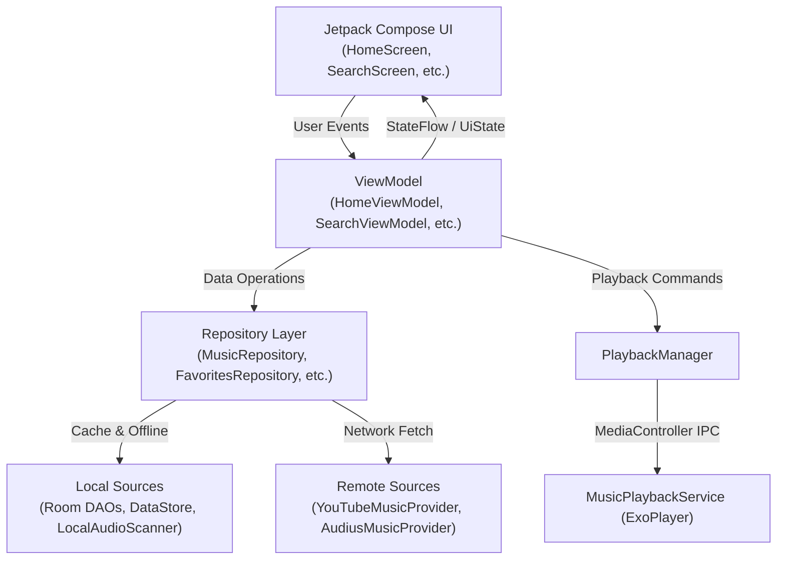

# Android Architecture Documentation

## Overview

The Musync Android application is written in Kotlin targeting SDK 35 with a minimum SDK of 26. It utilizes Jetpack Compose for UI, AndroidX Media3 for audio streaming, Room for local caching/persistence, Jetpack DataStore and EncryptedSharedPreferences for preferences/security, and Firebase for authentication and cloud sync.

---

## Package Organization

The application codebase is organized under `com.musync.app`:

```text
com.musync.app/
├── MainActivity.kt                  # Single-Activity entry point & deep link dispatcher
├── MusyncApplication.kt             # Application class initializing MusyncContainer & Notification Channels
│
├── auth/
│   └── AuthManager.kt               # Firebase Auth manager (Google, GitHub OAuth, Guest session)
│
├── core/
│   ├── di/
│   │   └── MusyncContainer.kt       # Manual Dependency Injection & Service Locator
│   ├── image/
│   │   └── ImageQualityHelper.kt    # Dynamic image resolution selector based on network type
│   ├── media/
│   │   ├── AudioFocusHelper.kt      # Audio focus request & ducking helper
│   │   └── MediaItemMapper.kt       # Conversion between Domain Track and Media3 MediaItem
│   └── network/
│       └── NetworkQualityHelper.kt  # Real-time network speed & connection classifier (WiFi/LTE/3G/2G)
│
├── data/
│   ├── local/
│   │   ├── database/                # Room SQLite Database & DAOs
│   │   ├── datastore/               # PreferencesManager with DataStore & EncryptedSharedPreferences
│   │   └── scanner/                 # LocalAudioScanner for on-device storage MP3/FLAC indexing
│   ├── remote/                      # Music providers (Universal, YouTube, Audius, Mock) and DTOs
│   ├── repository/                  # Implementations of domain repository interfaces
│   └── sync/                        # CloudSyncManager for Firestore two-way synchronization
│
├── domain/
│   ├── model/                       # Domain data classes (Track, Artist, Album, Playlist, PlaybackState)
│   ├── provider/                    # MusicProvider interface contract
│   └── repository/                  # Repository interface contracts
│
├── playback/
│   ├── AudioEffectManager.kt        # Android Equalizer, BassBoost, Virtualizer, LoudnessEnhancer
│   ├── BeatDetectorAudioProcessor.kt# 4th-order IIR dual-band real-time beat analyzer for PCM streams
│   ├── BeatHapticManager.kt         # VibrationEffect triggers for physical kick/snare haptic feedback
│   ├── MediaCacheManager.kt         # Media3 SimpleCache (200MB LRU on-disk audio storage)
│   ├── MusicPlaybackService.kt      # MediaLibraryService hosting ExoPlayer and background playback
│   ├── PlaybackManager.kt           # MediaController client managing state and UI updates
│   └── TrackPreloadManager.kt       # Proactive Next-Track (N+1) cache preloader and (N+2) Redis resolver
│
├── ui/
│   ├── auth/                        # AuthBottomSheet and AccountProfileCard
│   ├── components/                  # Common UI components, TrackItem, MiniPlayer, GlassmorphicCard
│   ├── home/                        # HomeScreen and HomeViewModel
│   ├── library/                     # LibraryScreen and LibraryViewModel
│   ├── navigation/                  # NavGraph, Screen definitions, and Floating Bottom Bar
│   ├── player/                      # NowPlayingSheet, PlayerViewModel, QueueSheet, AtmosphericBackground
│   ├── playlist/                    # PlaylistDetailScreen and PlaylistViewModel
│   ├── search/                      # SearchScreen and SearchViewModel
│   ├── settings/                    # SettingsScreen and SettingsViewModel
│   └── theme/                       # Color, Typography, and MusyncTheme
│
└── update/
    └── AppUpdateManager.kt          # In-app OTA updater via GitHub Releases and backend fallback
```

---

## Architectural Flow

The application follows an MVVM architecture with unidirectional data flow:



### 1. Presentation Layer (Jetpack Compose)
* Screens observe state from ViewModels using `collectAsState()`.
* Components use Compose state hoisting and lambda callbacks for user interactions.
* `MainActivity` sets up `MusyncTheme` and launches `MainApp(app, navController)`.
* Deep link routing is handled for `musync://home`, `musync://search`, `musync://library`, `musync://settings`, `musync://playlist/{playlistId}`, and `musync://track/{id}`.

### 2. ViewModel Layer
* ViewModels inherit from `androidx.lifecycle.ViewModel` and are instantiated with custom `ViewModelProvider.Factory` implementations.
* ViewModels expose immutable `StateFlow` streams for UI state and handle asynchronous tasks within `viewModelScope`.

### 3. Domain & Repository Layer
* Domain models (`Track`, `Artist`, `Album`, `Playlist`, `PlaybackState`) are pure Kotlin data classes decoupled from database or JSON frameworks.
* Repositories implement domain contracts (`MusicRepository`, `FavoritesRepository`, `PlaylistRepository`, `RecentlyPlayedRepository`).

### 4. Dependency Injection
* `MusyncContainer` (in `com.musync.app.core.di`) acts as the application's central service locator.
* Singletons are lazily created via `by lazy` using the application `Context`.
* Initialized in `MusyncApplication.onCreate()` and accessed throughout ViewModels via `app.container`.
