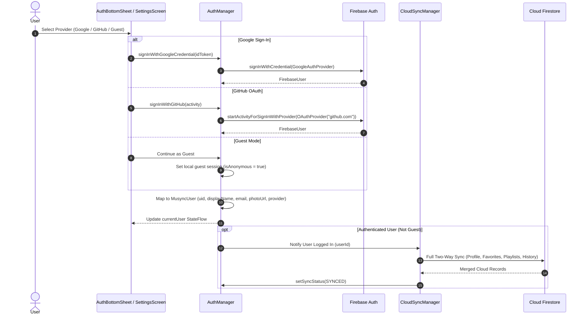

# Authentication Architecture Documentation

## Overview

Musync uses **Firebase Authentication** for user identity, supporting Google Sign-In, GitHub OAuth, and an offline Guest Mode. Authentication state is exposed as a reactive `StateFlow` and triggers automatic cloud data synchronization upon sign-in.

---

## Authentication Flow Diagram



---

## Supported Authentication Providers

### 1. Google Sign-In
* Executed via Google Play Services / Google Sign-In ID Tokens.
* Handled in `AuthManager.signInWithGoogleCredential(idToken: String)` using `GoogleAuthProvider.getCredential(idToken, null)`.

### 2. GitHub OAuth
* Implemented using Firebase `OAuthProvider.newBuilder("github.com")`.
* Requests scopes `read:user` and `user:email`.
* Invokes `auth.startActivityForSignInWithProvider(activity, provider)` or handles `auth.pendingAuthResult`.

### 3. Guest Mode
* Allows users to use all core features (playback, search, local playlists, local favorites, equalizer) without creating an account.
* Data is stored locally in Room SQLite without syncing to Firestore.

---

## Session & State Management

* **`MusyncUser` Model**:
  ```kotlin
  data class MusyncUser(
      val uid: String,
      val displayName: String?,
      val email: String?,
      val photoUrl: String?,
      val provider: AuthProviderType, // GOOGLE, GITHUB, GUEST
      val isAnonymous: Boolean = false
  )
  ```
* **Auth State Listening**:
  `AuthManager` registers an `AuthStateListener` with `FirebaseAuth.getInstance()` upon initialization, automatically updating `currentUser: StateFlow<MusyncUser?>`.
* **Sync Status**:
  Exposes `syncStatus: StateFlow<CloudSyncStatus>` (`IDLE`, `SYNCING`, `SYNCED`, `OFFLINE`, `ERROR`).
* **Sign Out**:
  Invoking `AuthManager.signOut()` clears Firebase session credentials, resets `currentUser` to `null`, and resets cloud sync state.
