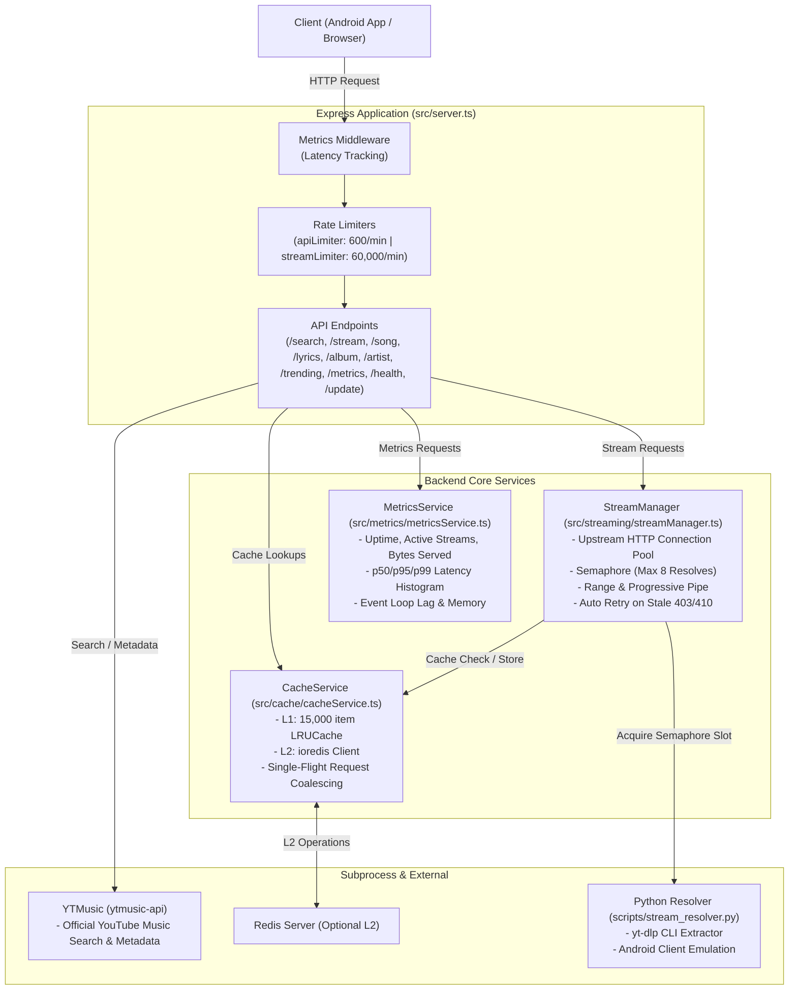

# Backend Architecture Documentation

## Overview

The Musync backend is a TypeScript/Node.js application running on Express. It acts as an API gateway, audio streaming proxy, search engine aggregator, and caching layer. It integrates with YouTube Music and utilizes a Python subprocess running `yt-dlp` to extract and resolve streaming URLs.

---

## Directory Structure

```text
backend/
├── src/
│   ├── server.ts                    # Main Express application, routes, and startup orchestration
│   ├── cache/
│   │   └── cacheService.ts          # Tiered L1 (In-Memory LRU) + L2 (Redis) cache & single-flight coalescing
│   ├── metrics/
│   │   └── metricsService.ts        # Telemetry, latency percentiles, memory, event loop lag monitoring
│   └── streaming/
│       └── streamManager.ts         # High-concurrency audio range proxy, process semaphore, backpressure
├── scripts/
│   └── stream_resolver.py           # Python 3 / yt-dlp audio stream extractor
├── Dockerfile                       # Multi-stage production container with Node, Python, ffmpeg, yt-dlp
├── Dockerfile.node                  # Node-only container variant
├── railway.json                     # Railway deployment configuration
├── package.json                     # Dependencies, scripts, and build metadata
├── requirements.txt                 # Python dependencies (yt-dlp)
└── tsconfig.json                    # TypeScript compiler options (NodeNext / ES2022)
```

---

## Architecture Diagram



---

## Server Initialization & Lifecycle

1. **Environment Setup**: Loaded via `dotenv.config()`. `trust proxy` is enabled to support load balancers and CDNs.
2. **`yt-dlp` Upgrade Check**: `upgradeYtDlp()` invokes `pip install -U yt-dlp` on startup to ensure extraction algorithms match current upstream video providers.
3. **YTMusic Initialization**: `ytmusic.initialize()` authenticates and configures the internal client.
4. **Port Binding**: Starts on `PORT` (defaults to 5000) with tuned HTTP keep-alive timeouts (`keepAliveTimeout = 65000`, `headersTimeout = 66000`).
5. **Pre-warming**: After 5 seconds, `StreamManager.preWarmPopularTracks(15)` pre-populates L1 cache with popular tracks stored in Redis.
6. **Graceful Shutdown**: Intercepts `SIGTERM` and `SIGINT` to close the HTTP server, drain active socket connections, release Redis pools, and exit cleanly.

---

## Stream Management (`StreamManager`)

* **Process Semaphore**: Limits concurrent Python `yt-dlp` invocations to a maximum of 8 (`MAX_CONCURRENT_RESOLVES = 8`) to preserve container memory on resource-constrained platforms.
* **Single-Flight Coalescing**: Uses `cacheService.coalesce()` to guarantee that multiple concurrent requests for the same un-cached audio track share a single resolution promise rather than triggering redundant `yt-dlp` subprocesses.
* **Range-Aware Proxy**:
  * Forwards HTTP `Range` headers to upstream audio CDNs.
  * Streams chunks directly via Node.js stream `.pipe(res)` with native backpressure handling.
  * Captures client disconnects (`req.on("close")`) to instantly abort upstream requests (`AbortController.abort()`) and avoid socket leaks.
  * Automatically retries on upstream 403/410 by purging stale cached URLs and requesting fresh stream signatures.

---

## Caching Strategy (`CacheService`)

* **L1 Cache**: In-memory `LRUCache` storing up to 15,000 items with a default 1-hour TTL.
* **L2 Cache**: Redis connection via `ioredis` with auto-reconnect and fallback to standalone L1 mode if Redis is not configured.
* **Track Popularity**: Uses Redis sorted set `zincrby("musync:popular_tracks", 1, trackId)` to identify trending songs across instances for proactive cache pre-warming.
