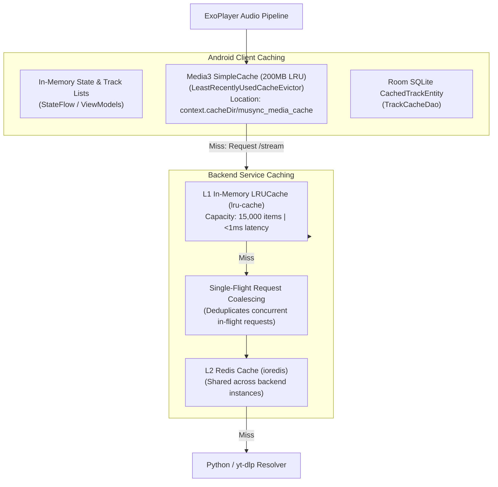

# Caching Architecture Documentation

## Overview

Musync employs a multi-tiered caching architecture spanning the native Android client and the backend gateway. Caching is used at every layer to minimize latency, reduce bandwidth consumption, prevent upstream rate-limiting, and enable gapless playback.

---

## Caching Topology

---

## 1. Backend Cache Layer (`backend/src/cache/cacheService.ts`)

### Tiered Hierarchy (L1 → L2)
1. **L1 In-Memory Cache**:
   * Backed by `lru-cache`.
   * Capacity: 15,000 items.
   * Default TTL: 1 hour (with `updateAgeOnGet: true`).
2. **L2 Redis Cache**:
   * Backed by `ioredis`.
   * Automatically connected when `REDIS_URL` or `REDIS_HOST` is present in the environment.
   * If Redis is disconnected, the service falls back gracefully to standalone L1-only mode.

### Cache Key Namespaces & TTLs

| Cache Key Pattern | Target Data | TTL | Description |
| :--- | :--- | :--- | :--- |
| `stream:v3:audio:<videoId>:<quality>` | Resolved Audio Stream URL & Headers | 2 Hours (7200s) | Protects signed CDN playback URLs from expiry |
| `search:v2:<query>` | Formatted Search Results Array | 45 Minutes (2700s) | Accelerates recurring and popular searches |
| `sug:<query>` | Autocomplete Query Suggestions | 1 Hour (3600s) | Reduces load on YouTube search suggestion API |
| `song_meta:<videoId>` | Song Details & Formatted Title/Artist | 24 Hours (86400s) | Metadata persistence |
| `album:<albumId>` | Full Album Tracklist & Metadata | 24 Hours (86400s) | Album view caching |
| `artist:<artistId>` | Artist Info & Discography | 24 Hours (86400s) | Artist profile caching |
| `trending:global` | Curated Global Hits Tracklist | 1 Hour (3600s) | Home screen discovery |
| `lyrics:<videoId>` | Synchronized/Plain Track Lyrics | 7 Days (604800s) | Long-term text caching |
| `update:latest:v2` | GitHub Releases Latest Metadata | 5 Minutes (300s) | Prevents GitHub API rate limits during app launches |

### Single-Flight Request Coalescing
`CacheService.coalesce<T>(key, fetcher)` ensures that if multiple users or parallel pre-warms request the same unresolved key simultaneously, only one extraction task is executed. All other concurrent requests subscribe to the active promise and receive the identical result.

### Popularity Tracking & Auto Pre-Warming
* Every played track increments a score in Redis sorted set `musync:popular_tracks`.
* On server boot, `StreamManager.preWarmPopularTracks(15)` reads the top 15 tracks from Redis and resolves their stream URLs into L1 cache before users request them.

---

## 2. Android Client Audio Caching (`MediaCacheManager.kt`)

* **Storage Engine**: AndroidX Media3 `SimpleCache`.
* **Eviction Policy**: `LeastRecentlyUsedCacheEvictor` with a **200 MB** quota.
* **Storage Location**: `context.cacheDir/musync_media_cache`.
* **Behavior**:
  * Chunks streamed over HTTP are intercepted by `CacheDataSource` and written to local disk.
  * Subsequent plays, loops, or backward seeks are served directly from disk with zero network overhead.

---

## 3. Next-Track Audio Preloading (`TrackPreloadManager.kt`)

* When Track $N$ starts playing, `TrackPreloadManager` waits 2.5 seconds (allowing Track $N$ to buffer smoothly), then:
  1. Streams the initial **512KB** (on Wi-Fi) or **128KB** (on Mobile) of Track $N+1$ into `SimpleCache`.
  2. Issues a pre-warm request to `/stream/preload?id=<videoId>` for Track $N+2$.
* Results in near instantaneous (0ms perceived latency) track switching.
