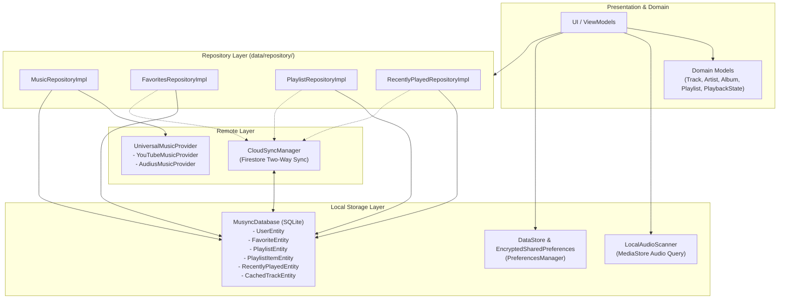

# Data Architecture Documentation

## Overview

Musync employs a hybrid data architecture combining local persistence (Room SQLite database, Jetpack DataStore, Android MediaStore scanner) and remote providers (YouTube Music, Audius API, Firebase Firestore).

---

## Data Layer Overview

---

## 1. Domain Models (`domain/model/`)

* **`Track`**: Identifier (`id`), `title`, `artist: Artist`, `album: Album?`, `durationMs`, `streamUrl`, `artworkUrl`, `genre`, `playCount`, `isLocal`.
* **`Artist`**: `id`, `name`, `imageUrl`, `handle`.
* **`Album`**: `id`, `name`, `artist: Artist`, `artworkUrl`, `year`, `trackCount`.
* **`Playlist`**: `id`, `name`, `description`, `artworkUrl`, `tracks: List<Track>`, `isCustom`.
* **`PlaybackState`**: Current track, playback status (`isPlaying`, `isBuffering`), position, buffer depth, duration, queue, repeat/shuffle mode.
* **`LanguagePlaylist`**: Curated regional categories (e.g., Telugu, Hindi, English, Tamil).

---

## 2. Local Database (`MusyncDatabase.kt`)

Built using **Room 2.6.1** with SQLite.

### Entities & DAOs

| Entity | Table | Description | DAO Interface |
| :--- | :--- | :--- | :--- |
| `UserEntity` | `users` | Authenticated user profile metadata | `UserDao` |
| `FavoriteEntity` | `favorites` | Favorited tracks | `FavoritesDao` |
| `PlaylistEntity` | `playlists` | User-created custom playlists | `PlaylistDao` |
| `PlaylistItemEntity` | `playlist_items` | Track entries linked to playlists | `PlaylistDao` |
| `RecentlyPlayedEntity` | `recently_played` | Playback history ordered by timestamp | `RecentlyPlayedDao` |
| `CachedTrackEntity` | `cached_tracks` | Cached track metadata | `TrackCacheDao` |

---

## 3. Preferences & Security (`PreferencesManager.kt`)

* **Jetpack DataStore**: Asynchronously manages reactive UI preferences (`Flow`):
  * `baseUrl`: Active backend URL (default: `https://musync-production-2fc5.up.railway.app`).
  * `audioQuality`: Audio quality level (`saver`, `low`, `standard`, `high`).
  * `hapticIntensity`: `OFF`, `SUBTLE`, `BALANCED`, `HEAVY`.
  * `equalizerPreset`: Active EQ profile.
  * `isShuffle`, `repeatMode`.
* **EncryptedSharedPreferences**: AES256-GCM / AES256-SIV hardware-backed encryption via AndroidX Security Crypto for sensitive tokens and API keys.

---

## 4. Local Audio Scanning (`LocalAudioScanner.kt`)

Queries the Android device's `MediaStore.Audio.Media.EXTERNAL_CONTENT_URI` to discover local audio files:
* Reads `TITLE`, `ARTIST`, `ALBUM`, `DURATION`, and `_DATA` (file path).
* Formats files into domain `Track` objects with `isLocal = true` and `streamUrl = "file://<path>"`.

---

## 5. Remote Providers (`data/remote/`)

* **`UniversalMusicProvider`**: Composite aggregator coordinating parallel queries across YouTube Music and Audius.
* **`YouTubeMusicProvider`**: Interfaces with the Musync backend (`/search`, `/song`, `/stream`, `/lyrics`, `/suggestions`).
* **`AudiusMusicProvider`**: Communicates with the decentralized Audius network using Retrofit and Gson.

---

## 6. Cloud Sync (`CloudSyncManager.kt`)

Synchronizes user data with **Firebase Firestore**:
* **User Profiles**: Stored in `users/{userId}`.
* **Favorites**: Synchronized to `users/{userId}/favorites/{trackId}` with two-way merge resolution.
* **Playlists**: Synchronized to `users/{userId}/playlists/{playlistId}`.
* **History**: Synchronized to `users/{userId}/history/{trackId}`.
* Uses Firestore batch commits (up to 450 items per write batch) to optimize network efficiency.
