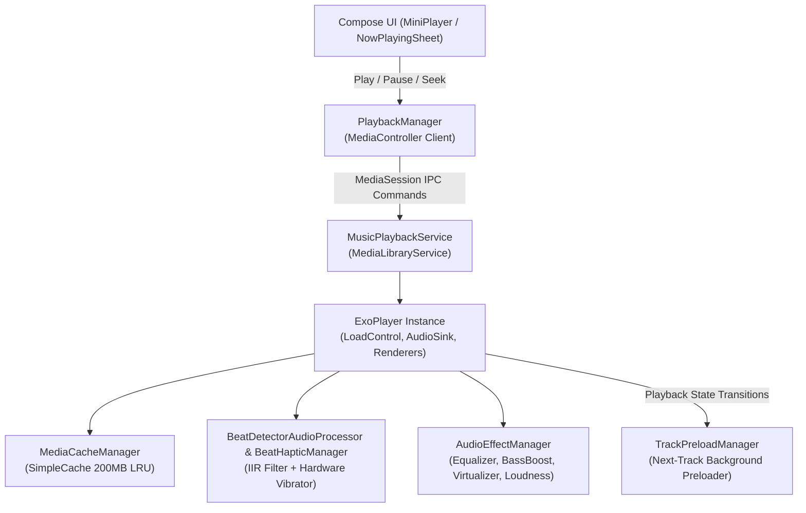
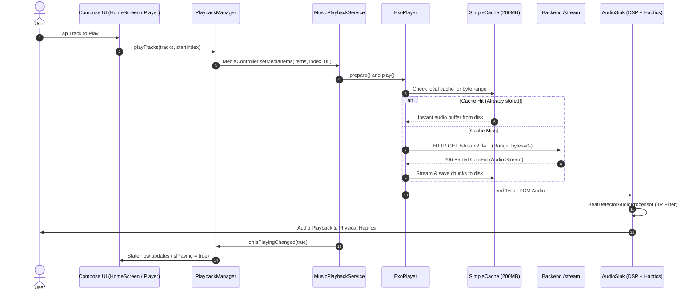

# Playback Architecture Documentation

## Overview

Musync features a resilient playback architecture built on **AndroidX Media3 1.4.1** and **ExoPlayer**. The architecture guarantees background audio playback, low-latency startup, zero-gap track transitions, on-device audio caching, real-time dual-band haptic beat detection, and hardware DSP equalization.

---

## Core Playback Components

---

## Component Details

### 1. `MusicPlaybackService.kt`
* Extends `MediaLibraryService` to host a `MediaLibrarySession` with system notification integration.
* **Audio Attributes**: Content type `C.AUDIO_CONTENT_TYPE_MUSIC`, usage `C.USAGE_MEDIA`.
* **Network & DataSource Configuration**:
  * `DefaultHttpDataSource.Factory` with 20s connect and 30s read timeouts.
  * Wrapped by `CacheDataSource.Factory` pointing to `MediaCacheManager.getCache()`.
* **LoadControl Configuration**:
  * `minBufferMs`: 8,000ms (8 seconds)
  * `maxBufferMs`: 60,000ms (60 seconds)
  * `bufferForPlaybackMs`: 800ms (0.8 seconds startup for fast audio playback)
  * `bufferForPlaybackAfterRebufferMs`: 1,500ms (1.5 seconds)
  * `backBufferMs`: 15,000ms (15 seconds back-buffer for instant rewinding)
* **Custom Audio Sink**: Configured with 16-bit PCM output and custom `BeatDetectorAudioProcessor`.
* **Error Recovery**: Automatically retries a failed track up to 3 times before giving up.
* **Media3 Library Tree**: Exposes categories (`Trending Music`, `Favorites`, `Recently Played`) for automotive and external MediaBrowser controllers.

### 2. `PlaybackManager.kt`
* Connects asynchronously to `MusicPlaybackService` using a `MediaController` token.
* Exposes an immutable `StateFlow<PlaybackState>` to the Compose UI containing current track details, playback position, buffer depth, repeat/shuffle status, and queue items.
* Maintains a polling progress tracker (`progressJob`) updating current position every 500ms while playing.
* Automatically selects audio streaming quality based on live connection speed via `NetworkQualityHelper`.

### 3. `MediaCacheManager.kt`
* Singleton managing a Media3 `SimpleCache` instance stored in `context.cacheDir/musync_media_cache`.
* Size: **200 MB** with `LeastRecentlyUsedCacheEvictor`.
* Backed by `StandaloneDatabaseProvider`.

### 4. `TrackPreloadManager.kt`
* Preloads the upcoming queue items in the background:
  * **Next Track (N+1)**: Preloads the initial 512KB (Wi-Fi) or 128KB (Mobile) chunk into `SimpleCache` using `CacheDataSource`.
  * **Following Track (N+2)**: Sends a lightweight `GET /stream/preload?id=...` request to warm backend and Redis resolution caches.
* Tracks preloads using a `ConcurrentHashMap` with a 90-minute stale expiry.

### 5. `BeatDetectorAudioProcessor.kt` & `BeatHapticManager.kt`
* **Real-Time DSP Beat Detection**:
  * Dual-band frequency separation on 256-sample micro-windows (~5.8ms per window).
  * **Low Band (Kicks / Sub-Bass 40Hz - 130Hz)**: 4th-order cascaded IIR low-pass filter (~110Hz cutoff) with dynamic variance and running standard deviation analysis.
  * **High Band (Snares / Claps / Hi-Hats 2.5kHz - 8kHz)**: 2nd-order high-pass filter (~2600Hz cutoff) with positive onset flux calculation.
* **Haptics Engine (`BeatHapticManager`)**:
  * Fires Android `VibrationEffect` instances with calibrated durations and intensities (`OFF`, `SUBTLE`, `BALANCED`, `HEAVY`).
  * Provides distinct waveforms for kicks (deep resonant pulses) and snares (crisp micro-ticks).

### 6. `AudioEffectManager.kt`
* Attaches directly to ExoPlayer's `audioSessionId`.
* Controls Android hardware audio effects:
  * **Equalizer**: 5-band frequency adjustment (-1500mB to +1500mB).
  * **BassBoost**: Configurable strength (0 to 1000).
  * **Virtualizer**: Spatial surround sound widening (0 to 1000).
  * **LoudnessEnhancer**: Target gain enhancement (0 to 1000mB).
* Ships with built-in presets: `Flat`, `Bass Boost`, `Vocal Focus`, `Treble Boost`, `Rock`, `Electronic`, and `Custom`.

---

## Playback Sequence Diagram

