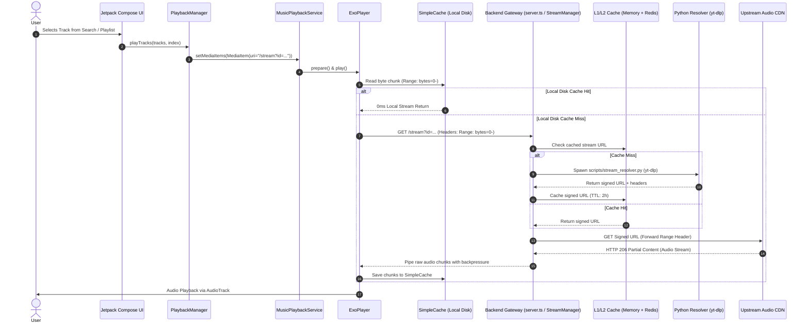

# Streaming Pipeline Documentation

## Overview

The Musync audio streaming pipeline streams high-fidelity audio from external providers to the user's headphones via progressive HTTP chunk streaming, dynamic connection pooling, Range requests, and real-time DSP/Haptics processing.

---

## Streaming Sequence Diagram

---

## Key Pipeline Stages

### 1. Track Search & Selection
* User searches for songs via `/search?query=...`.
* The backend runs a parallel search across songs and general results, applies relevance scoring and deduplication, and returns standardized track metadata.
* **Proactive Pre-warming**: The backend immediately pre-resolves audio stream URLs for the top 5 search results in the background (`prewarmSearchResults`).

### 2. Client-Side Quality Adaptation
* `NetworkQualityHelper` classifies the active network connection (Wi-Fi, 5G, 4G/LTE, 3G, 2G).
* Quality is mapped accordingly:
  * 2G / Poor: `saver` (~48kbps)
  * 3G: `low` (~48-64kbps)
  * 4G/LTE: `standard` (~96kbps)
  * 5G / Wi-Fi: `high` (~128-160kbps Opus / AAC)
* The stream URI is parameterized: `/stream?id=<videoId>&quality=<quality>`.

### 3. Backend Stream Resolution (`StreamManager`)
* Checks L1 LRU and L2 Redis caches for the key `stream:v3:audio:<videoId>:<quality>`.
* If missing:
  * Coalesces concurrent calls via `singleFlight` promise map.
  * Acquires a slot from the resolution semaphore (capped at 8 concurrent subprocesses).
  * Executes `python scripts/stream_resolver.py <videoId> <quality> audio`.
  * Returns the direct stream URL, HTTP headers, audio format, and expires timestamp.
  * Caches the result for 2 hours in L1 and L2.

### 4. Progressive Audio Chunking & Proxying
* `StreamManager.handleStreamRequest` executes an upstream HTTP request using a pooled `streamHttpClient` (`http.Agent` / `https.Agent` with `maxSockets = 10000`).
* Supports full HTTP Range requests (`Range: bytes=0-1024`, `bytes=500000-`).
* Passes downstream headers: `Content-Type`, `Accept-Ranges: bytes`, `Content-Range`, `Content-Length`, and `Cache-Control: public, max-age=7200, no-transform`.
* Pipes data directly via Node.js stream `.pipe(res)` with native backpressure management.

### 5. Client Disconnect Handling
* Listens for `req.on("close")`. If the client closes the connection (e.g. user skips track), the backend triggers `AbortController.abort()` to terminate the upstream CDN connection instantly, preventing socket leaks and wasted upstream bandwidth.

### 6. Resilient Stale URL Retry
* If an upstream CDN returns `403 Forbidden` or `410 Gone` (indicating expired signatures), `StreamManager` purges the cached entry, forces a fresh Python resolution, and retries the upstream request transparently before returning a failure to the client.
