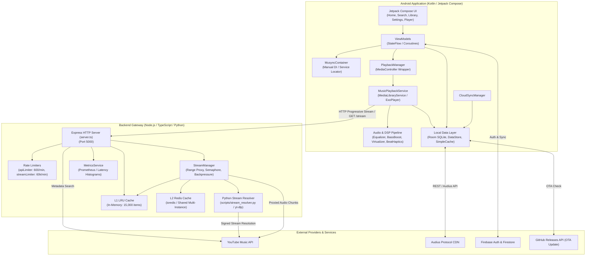

# Musync System Architecture

## Overview

Musync is a high-performance audio streaming platform consisting of a native Android client (Kotlin, Jetpack Compose, AndroidX Media3) and a Node.js/TypeScript backend service integrated with a Python-based audio resolver (`yt-dlp`).

The platform provides resilient audio streaming, dual-engine music sourcing (YouTube Music and Audius), low-latency caching (in-memory L1, Redis L2, and Android Media3 SimpleCache), real-time haptic beat detection, hardware DSP audio effects, and cloud profile synchronization via Firebase.

---

## High-Level Architecture Diagram

---

## Major Components

### 1. Android Application (`android/`)
* **Entry Points**: `MainActivity` and `MusyncApplication`.
* **UI & Presentation**: Built entirely using Jetpack Compose and Material 3 with a custom dark theme and glassmorphic navigation bar.
* **Dependency Injection**: Structured via `MusyncContainer`, a manual service locator managing application singletons.
* **Playback Engine**: Media3 `MediaLibraryService` hosting an `ExoPlayer` instance configured with a 200MB LRU disk cache (`MediaCacheManager`), a 4th-order IIR dual-band haptic processor (`BeatDetectorAudioProcessor`), and hardware audio effects (`AudioEffectManager`).
* **Data Layer**: Room database (`MusyncDatabase`), encrypted/shared preferences via Jetpack DataStore (`PreferencesManager`), and a local audio scanner (`LocalAudioScanner`).

### 2. Backend Service (`backend/`)
* **Runtime**: Node.js 20+ with TypeScript (`tsx` execution).
* **HTTP Framework**: Express with rate limiting and keep-alive socket pooling (`http.Agent` / `https.Agent`).
* **Stream Proxy**: `StreamManager` handles progressive audio chunking with full HTTP Range request support (`Range: bytes=start-end`), single-flight request coalescing, and client abort handling.
* **Resolver Subprocess**: Python script `scripts/stream_resolver.py` leveraging `yt-dlp` in a concurrency-limited semaphore (maximum 8 concurrent processes) to prevent resource exhaustion.
* **Caching**: Tiered L1 (in-memory LRU via `lru-cache`) and L2 (Redis via `ioredis`).
* **Telemetry**: `MetricsService` tracking p50/p95/p99 latency histograms, bytes served, and event loop lag.

### 3. External Services
* **YouTube Music**: Queried via `ytmusic-api` for search metadata, track details, album info, lyrics, and suggestions.
* **Audius Network**: Decentralized audio streaming via `AudiusApiService` providing direct 320kbps streams.
* **Firebase**: Authentication via Google Sign-In and GitHub OAuth, plus cloud database synchronization for user profiles, favorites, playlists, and playback history using Firestore.
* **GitHub Releases**: OTA update provider for automated in-app APK version checking and installation.

---

## End-to-End Request Flow

### Search & Stream Flow
1. **User Query**: User enters a query into the Android search screen.
2. **Repository Call**: `MusicRepository` routes the query to `UniversalMusicProvider`.
3. **Provider Execution**: `YouTubeMusicProvider` makes an HTTP request to the backend `/search?query=...`.
4. **Backend Search**: Backend `server.ts` queries YouTube Music, ranks results by relevance scoring, caches them in L1, and kicks off background pre-warming for top tracks.
5. **Track Selection**: User selects a track. `PlaybackManager.play()` creates an AndroidX `MediaItem` pointing to `http://<host>:5000/stream?id=<videoId>&quality=<quality>`.
6. **Playback Initiation**: `MusicPlaybackService` hands the URL to `ExoPlayer`.
7. **Stream Resolution**: `ExoPlayer` issues a range request to `/stream?id=<videoId>`.
8. **Stream Proxying**: `StreamManager` checks L1/L2 cache for a warm signed audio URL. If not found, it acquires a semaphore slot, spawns `stream_resolver.py`, retrieves the direct stream URL, and streams raw audio chunks back to `ExoPlayer`.
9. **Real-time Processing**: In Android, `BeatDetectorAudioProcessor` monitors PCM audio buffers and fires physical haptics while `AudioEffectManager` applies equalizer filters.
