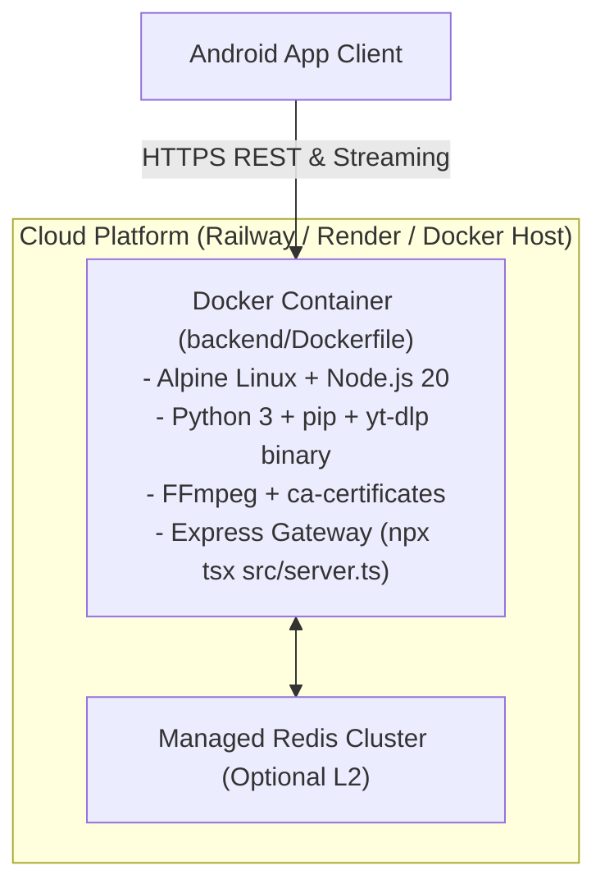

# Deployment Guide

## Production Topology



---

## 1. Dockerfile Specifications (`backend/Dockerfile`)

The primary production container is based on `node:20-alpine`:

```dockerfile
FROM node:20-alpine

WORKDIR /app

# Install Python 3, pip, ffmpeg, ca-certificates, curl
RUN apk add --no-cache python3 py3-pip ffmpeg ca-certificates curl && \
    ln -sf /usr/bin/python3 /usr/bin/python

# Install latest standalone official yt-dlp binary + pip package
RUN curl -L https://github.com/yt-dlp/yt-dlp/releases/latest/download/yt-dlp -o /usr/local/bin/yt-dlp && \
    chmod a+rx /usr/local/bin/yt-dlp && \
    pip install --no-cache-dir --break-system-packages -U yt-dlp

# Copy dependencies
COPY package*.json ./
RUN npm install

# Copy source and scripts
COPY tsconfig.json ./
COPY scripts ./scripts
COPY src ./src

EXPOSE 5000
ENV PORT=5000
ENV NODE_ENV=production

CMD ["npx", "tsx", "src/server.ts"]
```

---

## 2. Railway Cloud Deployment (`backend/railway.json`)

Musync includes native configuration for Railway:

```json
{
  "$schema": "https://railway.app/railway.schema.json",
  "build": {
    "builder": "DOCKERFILE",
    "dockerfilePath": "Dockerfile"
  },
  "deploy": {
    "startCommand": "npx tsx src/server.ts",
    "restartPolicyType": "ON_FAILURE",
    "restartPolicyMaxRetries": 10
  }
}
```

### Steps to Deploy to Railway
1. Fork or push the Musync repository to GitHub.
2. Log in to [Railway.app](https://railway.app) and create a **New Project from GitHub Repo**.
3. Set the root directory for the service to `backend`.
4. (Optional) Provision a **Redis** service in the same project; Railway automatically injects `REDIS_URL`.
5. Deploy. The backend will automatically build from `Dockerfile` and listen on the dynamically assigned `PORT`.
