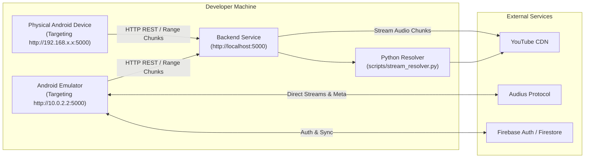

# Local Full-Stack Development

## Local Topology



---

## Step-by-Step Running Guide

### 1. Launch Backend Server

In a terminal, navigate to `backend/`:

```bash
cd backend
npm run dev
```

The server binds to `0.0.0.0:5000`.

### 2. Verify Backend Status

Open `http://localhost:5000/health` in your browser. Verify that `"ytmusic": true` and `"status": "healthy"`.

### 3. Launch Android Application

Open the `android/` directory in Android Studio.

#### Option A: Running in Android Emulator
1. Start an Android Virtual Device (AVD) running API 26 or higher.
2. In Android Studio, click **Run 'app'**.
3. In the app, navigate to **Settings** and set **Base URL** to:
   ```text
   http://10.0.2.2:5000
   ```
4. Perform a search to verify end-to-end communication.

#### Option B: Running on Physical Android Phone
1. Enable USB Debugging on your device and connect via USB or Wi-Fi debugging.
2. Find your workstation's local IP address (e.g. `192.168.1.150` via `ipconfig` or `ifconfig`).
3. In the app, navigate to **Settings** and set **Base URL** to:
   ```text
   http://192.168.1.150:5000
   ```
4. Verify playback starts.
